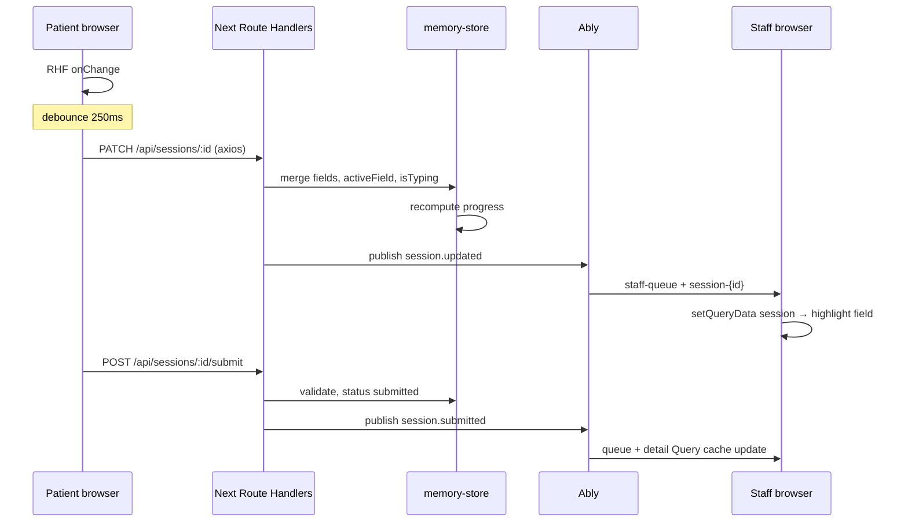

# Development Plan — Patient Intake + Staff Monitor

This document describes how the repo is structured, how patient vs staff UX differ, how domains compose, and how realtime sync works over Ably.

## Project structure

```
patient-intake/
├── apps/web/
│   ├── app/                          # Thin delivery layer (routes + API only)
│   │   ├── layout.tsx                # Root: fonts + globals + PublicEnvScript + QueryClientProvider
│   │   ├── (patient)/                # Patient shell → /
│   │   ├── (staff)/staff/            # Staff admin shell → /staff, /staff/[sessionId]
│   │   └── api/sessions/             # REST + publish hooks
│   ├── domains/
│   │   ├── session/                  # Lifecycle, store, Ably adapters, axios/Query client hooks
│   │   ├── patient-intake/           # Form UI + debounced sync hook
│   │   └── staff-monitor/            # Patient table + live detail + Ably → Query cache
│   ├── package.json
│   ├── .env.local                    # Ably keys (gitignored; copy from repo-root .env.example)
│   └── vitest.config.ts
├── packages/
│   ├── validation/                   # @patient/validation — schemas + constants
│   ├── ui/                           # @patient/ui — shadcn presentation primitives
│   └── typescript-config/            # @patient/typescript-config
├── docs/
│   └── development-plan.md           # This file (published)
├── README.md
├── package.json                      # Turborepo scripts
├── pnpm-workspace.yaml
├── turbo.json
├── eslint.config.mjs
├── .prettierrc
└── .env.example
```

Route groups `(patient)` and `(staff)` do not appear in URLs. Pages import domain barrels (`@/domains/...`) rather than wiring infrastructure directly.

**Env:** put keys in **`apps/web/.env.local`** only. Native Next loads env from the app directory; a repo-root `.env.local` is ignored. Browser public vars use `next-runtime-env` (`PublicEnvScript` + `env()`); server publish uses `process.env.ABLY_API_KEY`. There is no custom `next.config` env loader.

## Design notes

### Patient vs staff UX

| Surface                            | Layout                                   | Experience                                                                                                                                                                                         |
| ---------------------------------- | ---------------------------------------- | -------------------------------------------------------------------------------------------------------------------------------------------------------------------------------------------------- |
| **Patient** `(patient)/layout.tsx` | Calm check-in chrome, form-focused width | Single scrollable page with sections (Personal, Contact, Preferences, Emergency contacts). React Hook Form + shadcn Form; debounced axios PATCH while typing; add/remove emergency contacts (1–3). |
| **Staff** `(staff)/layout.tsx`     | Dark sidebar + main pane (`StaffShell`)  | Sidebar nav item **Patient**. `/staff` is a table (Name · Status · Progress · Updated). Detail is read-only, mirrors field definitions + `emergencyContacts[]`, highlights `activeField` + typing. |

### Clinic flow (demo)

1. Staff opens `/staff` (no authentication in v1).
2. Patient opens `/` → `POST /api/sessions` creates a session → appears in Patient table as `filling`.
3. Patient edits fields (including emergency contact array items) → debounced PATCH → staff table and detail update live via Ably → React Query cache.
4. Patient submits → full Zod validation → `status: submitted` → form locks; further PATCH returns **409**; staff sees final state.

Session statuses: `filling` | `submitted` | `abandoned` (timeout → `abandoned` is reserved for optional bonus C).

### Emergency contacts shape

Session/patient data uses an **array**, not a singular object:

```ts
emergencyContacts: Array<{ name: string; relation: string; phone: string }>; // length 1–3
```

- Submit: every item requires non-empty `name`, `relation`, and a valid Thai `phone` (shared `phoneSchema` / `emailSchema` in `@patient/validation`).
- Live PATCH: incomplete items allowed so staff sees typing; progress denominator uses indexed paths for the **current** array length only.

## Component architecture

### Domain boundaries

| Domain                  | Responsibility                                                              | Client vs server                                                                |
| ----------------------- | --------------------------------------------------------------------------- | ------------------------------------------------------------------------------- |
| **session**             | CRUD, progress recompute, in-memory store, Ably publish/subscribe contracts | **use-cases/** from Route Handlers; **client/** axios + TanStack Query hooks    |
| **patient-intake**      | Patient form composition, active field tracking, emergency `useFieldArray`  | **hooks/** (`useDebouncedSessionSync`, `usePatientSession`) + **components/**   |
| **staff-monitor**       | Patient table, live detail, Ably → Query cache                              | **hooks/** (`useQueueSubscription`, `useSessionSubscription`) + **components/** |
| **@patient/validation** | Shared kernel: types, Zod, enums, field config, contact rules               | No React                                                                        |
| **@patient/ui**         | shadcn Button, Input, Form, Table, Sidebar, Card, Skeleton, Empty, Alert, … | Presentation only                                                               |

Rules:

- Domains do not import each other’s UI components.
- `patient-intake` and `staff-monitor` talk to **session** via axios API helpers and Ably event payloads, not by reaching into `memory-store`. No raw `fetch` in domain code.
- React hooks live under `hooks/useXxxx.ts`; server orchestration lives under `use-cases/` (not named “application”).

### Data layer (axios + TanStack Query)

- One configured axios client; typed session API functions (create, list, get, patch, submit).
- Root `QueryClientProvider`; hooks `useSessions`, `useSession`, `useCreateSession`, `usePatchSession`, `useSubmitSession` with centralized `sessionKeys`.
- Ably events **write into the React Query cache**; HTTP refetch is the reconnect fallback (no parallel React state mirroring the session).
- `useDebouncedSessionSync` calls the patch mutation.

### Composition + single source of truth

Form rows and staff read-only rows both iterate **`FIELD_DEFINITIONS`** from `@patient/validation` for non-array demographics, grouped by `FormSection`. Zod schemas are derived from the same constants — no duplicated field lists in JSX.

Emergency contacts are rendered from the **`emergencyContacts` array** (patient `useFieldArray` + staff numbered cards), with labels from shared constants — not hard-coded static definition rows for three slots.

Patient form: `PatientIntakeForm` → section components → shadcn `Form` / inputs from `@patient/ui`.

Staff detail: `PatientLiveView` → section/card components + `FieldHighlight` for active/typing state.

### Naming conventions

- `*.interface.ts` — type contracts
- `*.helper.ts` — pure helpers under `helpers/`
- `Xxx.tsx` — UI under `components/` or `@patient/ui`
- Tests: `*.spec.ts` (Vitest)

## Realtime sync flow

### Sequence



Text flow (same path):

```
Patient types → React Hook Form onChange
  → debounce ~250ms (useDebouncedSessionSync)
  → PATCH /api/sessions/[id] via axios  { data, activeField, isTyping }
  → in-memory store update + progress recompute
  → Ably publish:
       • session-{id}  → staff detail subscribers
       • staff-queue   → Patient table (progress / status / updatedAt)
Staff UI → Query cache merge → highlight activeField + typing indicator
```

Typing clears after ~800ms idle (`IDLE_MS` in `useDebouncedSessionSync`).

Submit: `POST /api/sessions/[id]/submit` → full schema validation → `status: submitted` → publish `session.submitted` on both channels → patient UI disables editing; PATCH while submitted → **409**.

### Channel and event contract

| Channel               | Subscribers                             | Purpose                                       |
| --------------------- | --------------------------------------- | --------------------------------------------- |
| `staff-queue`         | Staff queue (`useQueueSubscription`)    | All session lifecycle events for list refresh |
| `session-{sessionId}` | Staff detail (`useSessionSubscription`) | Events for one session                        |

Channel helpers: `QUEUE_CHANNEL = "staff-queue"`, `sessionChannel(id) => "session-{id}"` (`domains/session/infrastructure/channels.ts`).

| Event name          | When emitted      | Payload                |
| ------------------- | ----------------- | ---------------------- |
| `session.created`   | New session       | `{ session: Session }` |
| `session.updated`   | PATCH applied     | `{ session: Session }` |
| `session.submitted` | Successful submit | `{ session: Session }` |

Types: `RealtimeEvent` in `domains/session/interfaces/realtime-event.interface.ts`.

Server publish: `publishToQueue` / `publishToSession` in `domains/session/infrastructure/publisher.ts` (REST uses `ABLY_API_KEY`). Client subscribe: Ably Realtime with `NEXT_PUBLIC_ABLY_KEY` via `next-runtime-env`.

### Connection and resync

- Ably connection state drives `@patient/ui` `ConnectionStatus` (reconnecting banner).
- On staff mount or reconnect, hooks reload via React Query (`useSessions` / `useSession`) to reconcile with in-memory truth before/after realtime events.

### Persistence caveat

The store is process-local. Cold starts on Vercel empty the Map; see README **Known limitation**. Realtime events still work for concurrent viewers on the **same** warm instance, but durability requires a future database.

## Quality gates

- **Lint:** `pnpm lint`
- **Format:** `pnpm format` / `pnpm format:check`
- **Unit tests:** `pnpm test` — focus on `@patient/validation` and pure session helpers
- **Manual E2E:** README checklist (two browsers, emergency contacts, mobile, reconnect, submit lock)
